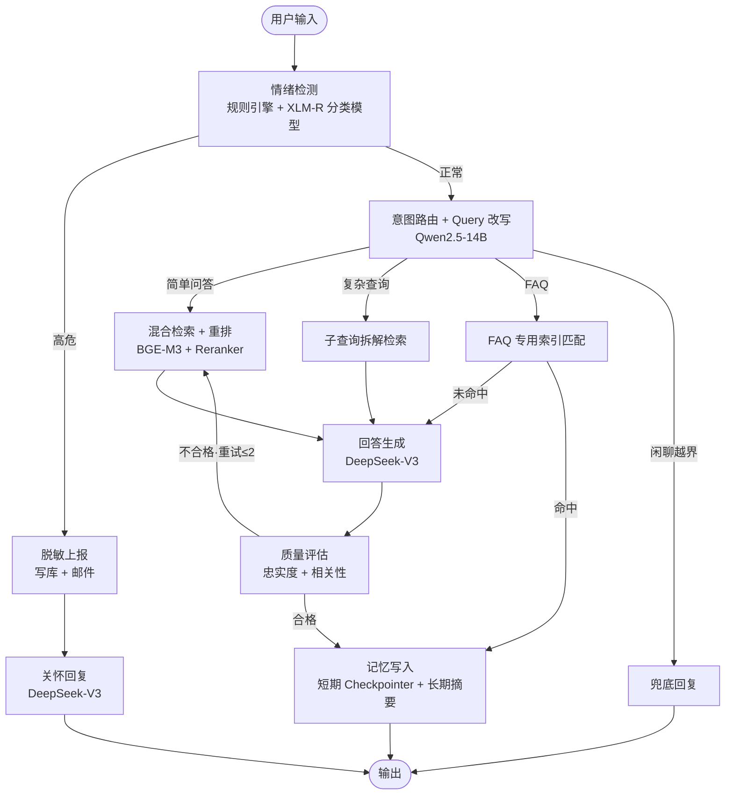

# 小旦答：复旦校园智能问答与心理健康监测系统

面向复旦全体师生的智能问答 Agent 系统：以 RAG 技术回答校园事务问题（选课、报到、宿舍、培养方案等），同时对对话中的心理健康信号进行早期监测与预警。

## 核心特性

- **校园知识问答**：BGE-M3 双路向量（稠密语义 + 稀疏关键词）混合检索，BGE-Reranker 精排，分类型文档切分策略，回答严格基于检索上下文（幻觉防控）
- **心理健康监测**：规则引擎 + XLM-RoBERTa 分类模型两层融合检测四级情绪（正常 / 轻度 / 中度 / 高危），高危召回率 > 95%
  为硬性上线指标
- **LangGraph Agent 编排**：11 节点状态图，情绪检测先行、意图四分支路由、在线质量评估 + 回退重试，流程完全可控可解释
- **高性价比模型分工**：核心生成用 DeepSeek-V3，轻量任务（意图路由 / 质量评估 / Query 改写）用 Qwen2.5-14B，情绪检测用 270M 的
  XLM-RoBERTa（GPU 推理 5-10ms）
- **全链路容错**：LLM 双向降级（DeepSeek ↔ 轻量端点互备）、组件级降级（模型缺失走规则兜底、数据库不可达走无记忆模式），任一组件故障不中断服务
- **隐私保护设计**：高危上报数据最小化（脱敏 ID + 内容摘要）、与业务数据物理隔离的独立表存储

## 系统架构



## 模块总览

| 模块               | 目录                             | 核心内容                                                                                                                                                                                                  |
|--------------------|----------------------------------|-----------------------------------------------------------------------------------------------------------------------------------------------------------------------------------------------------------|
| 一：知识库引擎     | `knowledge_base/`                | 官网增量爬虫 → Unstructured 解析 → 噪声清洗 → 分类型切分（FAQ/通知/手册/表格）→ BGE-M3 双路向量化 → Milvus 入库 → 混合检索（RRF 融合）+ Reranker 精排；FAQ 独立高置信度索引（阈值 0.85 直接返回标准答案） |
| 二：情绪检测引擎   | `emotion/`                       | 规则引擎（高危正则零延迟拦截 + 多轮累积升级）→ XLM-RoBERTa 微调（高危样本 3 倍损失权重 + 2 倍过采样 + 高危召回率早停）→ 两层融合（规则中度 + 模型高危概率超阈值 → 升级高危）；高危触发脱敏上报            |
| 三：Agent 核心引擎 | `agent/`                         | LangGraph 状态图 11 节点；短期记忆 PostgresSaver（thread_id 即会话），长期记忆摘要存 `user_memory` 表；生成时注入个性化背景                                                                               |
| 四：评估与可观测   | `evaluation/` + `observability/` | RAGAS 五指标（裁判用 GPT-4o 快照版跨模型族去偏）+ 情绪混淆矩阵（高危召回率门槛）+ 安全红队测试（30 条攻击用例）；Langfuse 全链路追踪（开关式）                                                            |
| 五：服务化         | `deployment/`                    | FastAPI 接口（`/chat`、`/health`）；Docker Compose 一键编排 Milvus + PostgreSQL + API 服务                                                                                                                |

## 技术栈

| 层次         | 选型                                                    |
|--------------|---------------------------------------------------------|
| Agent 编排   | LangGraph + PostgresSaver                               |
| 生成模型     | DeepSeek-V3（API）                                      |
| 轻量任务模型 | Qwen2.5-14B-Instruct-AWQ（vLLM 本地部署或云端兼容端点） |
| 情绪检测     | XLM-RoBERTa-base 全量微调                               |
| 检索         | BGE-M3（dense 1024 维 + sparse）+ BGE-Reranker-v2-M3    |
| 向量数据库   | Milvus 2.4（HNSW + 倒排索引，RRF 融合）                 |
| 关系数据库   | PostgreSQL 16（记忆 / 上报 / Checkpointer 三域分表）    |
| 评估         | RAGAS + scikit-learn                                    |
| 可观测       | Langfuse（可选）                                        |
| 服务         | FastAPI + Docker Compose                                |

## 快速开始

### 1. 环境准备

```bash
# 克隆项目
git clone https://github.com/changchen331/XiaoDan-Da.git && cd XiaoDan-Da

# 配置环境变量（按需填写，最少只需 DeepSeek Key）
cp .env.example .env

# 准备数据（见下节"数据准备"）
```

`.env` 关键配置：

| 变量                                          | 必要性   | 说明                                                                            |
|-----------------------------------------------|----------|---------------------------------------------------------------------------------|
| `DEEPSEEK_API_KEY`                            | 必填     | 回答生成模型                                                                    |
| `LOCAL_LLM_BASE_URL`                          | 推荐     | 轻量任务模型端点（本地 vLLM 或云端 OpenAI 兼容端点）；不可用时自动降级 DeepSeek |
| `OPENAI_API_KEY`                              | 评测需要 | RAGAS 裁判模型（GPT-4o 快照版）                                                 |
| `LANGFUSE_PUBLIC_KEY` / `LANGFUSE_SECRET_KEY` | 可选     | 配置后启用全链路追踪                                                            |
| `ALERT_EMAIL_*`                               | 可选     | 高危上报邮件通知                                                                |

### 2. 数据准备

数据放入 `data/` 目录（目录结构即数据契约）：

```
data/
├── raw/                        # 知识库原始文档（目录名决定切分策略）
│   ├── 手册/                   # 学生手册、培养方案等长文档（PDF/DOCX/TXT/MD）
│   ├── 通知/                   # 官网通知（爬虫自动产出或手动收集的 TXT/HTML）
│   ├── 表格/                   # 校历、时间表等（PDF/HTML）
│   └── faq.json               # FAQ 标准问答库
└── eval/                       # 评测集
    ├── rag_eval.json          # RAG 评测：[{id, question, reference_answer, user_profile}]
    ├── emotion_train.json      # 情绪训练语料：[{text, label}]
    └── emotion_eval.json       # 情绪评测集：[{id, text, label}]
```

`faq.json` 格式示例：

```json
[
  {
    "question": "校园卡丢了怎么办？",
    "answer": "请携带有效证件到一卡通中心挂失补办，工本费 20 元……",
    "similar_questions": [
      "校园卡挂失流程",
      "饭卡丢了去哪里补"
    ],
    "tags": [
      "校园卡"
    ]
  }
]
```

情绪语料标签取值：`正常 / 轻度困扰 / 中度困扰 / 高危`（高危样本建议占比 ≥ 8%，重点覆盖隐晦表达与边界 case）。

### 3. 启动服务

```bash
# 一键拉起完整服务栈（Milvus + PostgreSQL + API，8080 端口）
docker compose up -d

# 可选：追加 Langfuse 追踪面板（3000 端口）
docker compose --profile observability up -d
```

首次启动后构建知识库索引（容器内或本地均可）：

```bash
docker compose exec xiaodan-api python scripts/build_index.py data/raw
```

### 4. 使用

```bash
# CLI 交互模式（本地开发调试）
python main.py

# API 调用
curl -X POST http://localhost:8080/chat \
  -H "Content-Type: application/json" \
  -d '{"user_input": "本科生选课截止时间是什么时候？", "session_id": "s001"}'
```

## 模型训练（情绪检测）

```bash
# 微调 XLM-RoBERTa（单卡 4090 约 25-50 分钟）
python scripts/train_emotion_model.py --train data/eval/emotion_train.json

# 验证高危召回率（> 95% 达标）
python evaluation/emotion_eval.py --data data/eval/emotion_eval.json
```

训练产出自动保存至 `models/emotion-xlmr`（`.env` 的 `EMOTION_MODEL_PATH`），无需额外配置。类别不平衡处理：高危样本 3
倍损失权重 + 2 倍过采样，早停监控高危召回率而非整体准确率。

## 评测体系

| 评测       | 命令                                                                   | 目标                                                                                                                                 |
|------------|------------------------------------------------------------------------|--------------------------------------------------------------------------------------------------------------------------------------|
| RAG 端到端 | `python evaluation/ragas_eval.py --data data/eval/rag_eval.json`       | 五指标对照：context_precision > 0.80、context_recall > 0.75、faithfulness > 0.85、answer_relevancy > 0.85、answer_correctness > 0.80 |
| 情绪检测   | `python evaluation/emotion_eval.py --data data/eval/emotion_eval.json` | 高危召回率 > 95%（硬性上线门槛，宁可误报不可漏报）                                                                                   |
| 安全红队   | `python evaluation/red_team.py`                                        | Prompt 注入 / 越界 / 诱导编造 / 隐私套取 / 情绪操纵 五类攻击，人工判定通过率 100%                                                    |

评测明细自动导出 `rag_eval_report.csv`（逐条 Bad Case 定位）；红队结果快照写入 `data/eval/red_team_results.json`（verdict
字段回填人工判定）。

## 安全与隐私设计

- **高危阻断式干预**：情绪检测先于一切问答逻辑，高危输入直接进入「上报 → 关怀回复」分支，暂缓回答原始问题
- **上报数据最小化**：仅记录脱敏内部 ID + 触发内容前 100 字摘要 + 最近 3 轮上下文，不传输完整对话
- **数据物理隔离**：高危上报表（`emotion_alerts`）、长期记忆表（`user_memory`）、Checkpointer 内部表三域分立，可独立做权限控制
- **评测数据脱敏**：发送外部裁判 API 前自动替换手机号 / 学号
- **三层 Prompt 注入防御**：生成 Prompt 严格约束只基于检索上下文；闲聊越界分支兜底；红队测试覆盖 10 条注入用例

## 容错设计

| 故障场景            | 系统行为                                   |
|---------------------|--------------------------------------------|
| DeepSeek API 不可用 | 自动切换轻量端点（Qwen2.5-14B）            |
| 轻量端点不可用      | 自动切换 DeepSeek，JSON 模式三级回退       |
| 情绪分类模型缺失    | 降级纯规则引擎（安全兜底网仍在线）         |
| PostgreSQL 不可达   | 降级无记忆模式（调用方传入历史补偿）       |
| Milvus 异常         | 返回空结果集，生成节点明确答复「无法确定」 |
| 质量评估连续不合格  | 最多重试 2 次后强制放行（防死循环）        |

## 项目结构

```
XiaoDan-Da/
├── main.py                       # CLI 交互入口
├── requirements.txt              # 依赖清单（按模块分组）
├── docker-compose.yml            # 服务编排（Milvus/PostgreSQL/API/Langfuse）
├── .env.example                  # 环境变量模板
├── config/settings.py            # 全局配置中心
├── agent/                        # 模块三：Agent 核心引擎
│   ├── graph.py                  #   LangGraph 11 节点编排 + Checkpointer
│   ├── state.py                  #   AgentState 与节点结果模型
│   ├── llm_clients.py            #   LLM 客户端 + 双向降级链
│   ├── memory_store.py           #   长期记忆读写
│   └── nodes/                    #   11 个节点实现
├── knowledge_base/               # 模块一：知识库引擎
│   ├── crawler/                  #   官网增量爬虫
│   ├── preprocessing/            #   解析 / 清洗 / 分类型切分
│   ├── indexing/                 #   BGE-M3 向量化 / Milvus 建表
│   ├── retrieval.py              #   混合检索 + RRF 融合 + 重排
│   └── faq.py                    #   FAQ 高置信度专用索引
├── emotion/                      # 模块二：情绪检测引擎
│   ├── rule_engine.py            #   规则引擎（正则 + 多轮累积）
│   ├── classifier.py             #   XLM-RoBERTa 分类器
│   ├── detector.py               #   两层融合入口
│   └── reporting.py              #   脱敏上报（写库 + 邮件）
├── evaluation/                   # 模块四：评估
│   ├── ragas_eval.py             #   RAGAS 五指标端到端评测
│   ├── emotion_eval.py           #   情绪混淆矩阵 + 高危召回率
│   └── red_team.py               #   安全红队测试（30 用例）
├── observability/                # Langfuse 全链路追踪（开关式）
├── deployment/                   # 模块五：FastAPI 服务 + Dockerfile
├── scripts/                      # 索引构建 / 情绪模型训练
├── tests/                        # 单元测试（14 项，无外部依赖）
└── data/                         # 数据目录（结构见"数据准备"）
```

## 运行测试

```bash
python -m pytest tests/ -v
```

覆盖规则引擎、切分策略、文本清洗、两层降级、学期计算、JSON 解析等核心逻辑，不依赖任何外部服务（LLM / 数据库 / 向量库），14 项全部通过。
