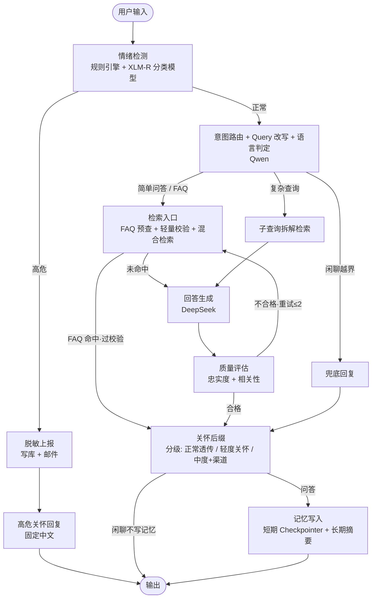

# 小旦答：复旦校园智能问答与心理健康监测系统

面向复旦全体师生的智能问答 Agent 系统：以 RAG 技术回答校园事务问题（选课、报到、宿舍、培养方案等），同时对对话中的心理健康信号进行早期监测与预警。

## 核心特性

- **校园知识问答**：BGE-M3 双路向量（稠密语义 + 稀疏关键词）混合检索，BGE-Reranker 精排，分类型文档切分策略，回答严格基于检索上下文（幻觉防控）
- **心理健康监测**：规则引擎 + XLM-RoBERTa 分类模型两层融合检测四级情绪（正常 / 轻度困扰 / 中度困扰 / 高危）；
  高危召回率 > 95% 为硬性上线指标。 **v2 实测：闭环语料仅 100 条时模型无区分度**
  （高危概率与普通提问完全重叠），已加置信度门槛、由规则引擎兜底——
  模型暂不承担高危判定，语料扩到 1500 条（v3）是硬性前置
- **分级情绪响应**：高危阻断式干预（上报 + 关怀回复）；轻度 / 中度困扰在正常回答末尾附加自然关怀后缀（LLM
  生成，中度含从配置注入的求助渠道，联系方式绝不来自模型编造）
- **LangGraph Agent 编排**：11 节点状态图，情绪检测先行、意图三路分流（FAQ 与简单问答合流）、FAQ 快路径（预查 +
  轻量校验）、在线质量评估 +
  回退重试，流程完全可控可解释
- **多语言偏好**：意图路由同轮判定回复语言（含"请用中文回答"类指令），经 checkpointer 会话级持久化；FAQ
  直返与生成均做语言适配；上报与高危关怀固定中文（面向后台处理者）
- **高性价比模型分工**：核心生成用 DeepSeek，轻量任务（意图路由 / 质量评估 / Query 改写 / FAQ 校验）用 Qwen，
  情绪检测用 270M 的 XLM-RoBERTa（GPU 推理 5-10ms）；三者均可通过环境变量切换型号
- **推理链路可控**：统一关闭厂商默认开启的思考模式——思考 token 按输出价计费，且会把 temperature
  强制改写（轻量任务本应按 0.1 求确定性）；需要时经 `*_THINKING` 开关按角色恢复
- **全链路容错**：LLM 三级降级（轻量端点 → DeepSeek → 本地兜底，任一跳失败自动下探）、组件级降级（模型缺失走规则兜底、数据库不可达走无记忆模式），任一组件故障不中断服务
- **隐私保护设计**：高危上报数据最小化（脱敏 ID + 内容摘要）、与业务数据物理隔离的独立表存储

## 系统架构



## 模块总览

| 模块               | 目录                             | 核心内容                                                                                                                                                                                                                      |
|--------------------|----------------------------------|-------------------------------------------------------------------------------------------------------------------------------------------------------------------------------------------------------------------------------|
| 一：知识库引擎     | `knowledge_base/`                | 官网增量爬虫 → Unstructured 解析 → 噪声清洗 → 分类型切分（FAQ/通知/手册/表格）→ BGE-M3 双路向量化 → Milvus 入库 → 混合检索（RRF 融合）+ Reranker 精排；FAQ 独立高置信度索引（阈值 0.85 + 轻量校验后直返标准答案）             |
| 二：情绪检测引擎   | `emotion/`                       | 规则引擎（高危正则零延迟拦截 + 多轮累积升级）→ XLM-RoBERTa 微调（**逆频次类别权重** + 2 倍过采样，倍率随语料分布自适应）→ 两层融合，**模型结论需过置信度门槛**（否则以规则引擎为准）；四级分级响应（关怀后缀 / 高危阻断上报） |
| 三：Agent 核心引擎 | `agent/`                         | LangGraph 状态图 11 节点（检索合流 + FAQ 快路径 + care_suffix 分级收尾）；回复语言会话级持久化；短期记忆 PostgresSaver（thread_id 即会话），长期记忆摘要存 `user_memory` 表                                                   |
| 四：评估与可观测   | `evaluation/` + `observability/` | RAGAS 五指标（裁判用 Qwen 日期快照版，与生成模型 DeepSeek 跨族去偏）+ 情绪混淆矩阵（高危召回率门槛）+ **切分策略对照实验（Recall@10）** + 安全红队测试（30 条攻击用例）；Langfuse 全链路追踪（开关式）                        |
| 五：服务化         | `deployment/`                    | FastAPI 接口（`/chat`、`/health`）；Docker Compose 一键编排 Milvus + PostgreSQL + API 服务（镜像内 uv 按锁文件安装依赖）                                                                                                      |

## 技术栈

| 层次         | 选型                                                        |
|--------------|-------------------------------------------------------------|
| Agent 编排   | LangGraph + PostgresSaver                                   |
| 生成模型     | DeepSeek（API，型号由 `DEEPSEEK_MODEL` 指定）               |
| 轻量任务模型 | Qwen（`LIGHT_LLM_BASE_URL` 可指向本地 vLLM 或云端兼容端点） |
| 评测裁判模型 | Qwen 日期快照版（`JUDGE_MODEL`，`temperature=0`）           |
| 情绪检测     | XLM-RoBERTa-base 全量微调                                   |
| 检索         | BGE-M3（dense 1024 维 + sparse）+ BGE-Reranker-v2-M3        |
| 向量数据库   | Milvus 2.4（HNSW + 倒排索引，RRF 融合）                     |
| 关系数据库   | PostgreSQL 16（记忆 / 上报 / Checkpointer 三域分表）        |
| 评估         | RAGAS + scikit-learn                                        |
| 可观测       | Langfuse（可选）                                            |
| 服务         | FastAPI + Docker Compose                                    |

## 快速开始

### 1. 环境准备

```bash
# 克隆项目
git clone https://github.com/changchen331/XiaoDan-Da.git && cd XiaoDan-Da

# 创建虚拟环境并按锁定文件精确安装依赖（需已安装 uv，见 https://docs.astral.sh/uv/）
uv sync

# 配置环境变量（按需填写，最少只需 DeepSeek Key）
cp .env.example .env

# 准备数据（见下节"数据准备"）
```

GPU 训练说明：`uv sync` 在 Windows 上安装的 torch 为 CPU 版；本机实测该构建下
BGE-Reranker 单次检索耗时 25–33s（全花在 CPU 上），换成 CUDA 构建后降到 **5.1s**。
需要 GPU 推理或训练情绪模型时，按显卡驱动选择 CUDA 通道重装 torch
（不经过锁文件，属"自由安装"）：

```bash
# 通道按显卡算力选：cu126 与本机 RTX 4070 Laptop（compute capability 8.9）匹配
uv pip install torch --index-url https://download.pytorch.org/whl/cu126 --upgrade
```

若该源在国内网络不可用（实测 download.pytorch.org 仅约 0.35 MB/s 且丢包），
可直接下 wheel 再本地安装（阿里云镜像 `mirrors.aliyun.com/pytorch-wheels/cu126/`
实测快 3.5 倍，但只有扁平目录、无 PEP503 索引，uv 无法直接解析）：

```bash
uv pip install --no-index --no-deps --find-links D:\torch-wheels "torch==2.14.0+cu126"
```

Linux 环境无需此步骤（PyPI 的 Linux torch 自带 CUDA）。

`.env` 关键配置（完整清单与逐项说明见 `.env.example`）：

| 变量                                        | 必要性     | 说明                                                                                             |
|---------------------------------------------|------------|--------------------------------------------------------------------------------------------------|
| `DEEPSEEK_API_KEY`                          | 必填       | 回答生成与高危关怀；密钥也可只放系统环境变量 `DEEPSEEK`                                          |
| `LIGHT_LLM_BASE_URL` / `LIGHT_LLM_API_KEY`  | 推荐       | 轻量任务端点（云端 OpenAI 兼容端点或本地 vLLM）；密钥缺省回退系统变量 `QWEN`；不可用时自动降级 DeepSeek |
| `DEEPSEEK_THINKING` / `LIGHT_LLM_THINKING`  | 建议 false | 思考模式开关；开启会改写 temperature，且思考 token 按输出价计费                                   |
| `JUDGE_MODEL` / `JUDGE_API_KEY`             | 评测需要   | RAGAS 裁判（`JUDGE_BASE_URL` 默认走百炼）；**必须带日期后缀的快照版**，否则跨迭代分数不可比       |
| `FALLBACK_LLM_ENABLED` / `FALLBACK_LLM_MODEL` | 可选     | 云端端点全部不可用时由本地模型接管轻量任务（两者齐备才生效）                                     |
| `LANGFUSE_PUBLIC_KEY` / `LANGFUSE_SECRET_KEY` | 可选     | 配置后启用全链路追踪                                                                             |
| `ALERT_EMAIL_*`                             | 可选       | 高危上报邮件通知                                                                                 |

**型号不在模板里写死**：厂商型号更迭很快（旧型号会被下线），`*_MODEL` 一律交给
`config/settings.py` 的默认值，需要固定版本时再在 `.env` 覆盖；端点同理——它随所用平台而异。

### 2. 数据准备

数据放入 `data/` 目录（目录结构即数据契约）：

```
data/
├── raw/                        # 知识库原始文档（目录名决定切分策略）
│   ├── 手册/                   # 学生手册、培养方案等长文档（PDF/DOCX/TXT/MD）
│   ├── 通知/                   # 官网通知（爬虫自动产出或手动收集的 TXT/HTML）
│   ├── 表格/                   # 校历、时间表等（PDF/HTML）
│   └── faq.json               # FAQ 标准问答库
└── eval/                       # 评测集
    ├── rag_eval.json          # RAG 评测：[{id, question, reference_answer, user_profile}]
    ├── emotion_train.json      # 情绪训练语料：[{text, label}]
    └── emotion_eval.json       # 情绪评测集：[{id, text, label}]
```

`faq.json` 格式示例：

```json
[
  {
    "question": "校园卡丢了怎么办？",
    "answer": "请携带有效证件到一卡通中心挂失补办，工本费 20 元……",
    "similar_questions": [
      "校园卡挂失流程",
      "饭卡丢了去哪里补"
    ],
    "tags": [
      "校园卡"
    ]
  }
]
```

情绪语料标签取值：`正常 / 轻度困扰 / 中度困扰 / 高危`（高危样本建议占比 ≥ 8%，重点覆盖隐晦表达与边界 case）。

没有现成语料时可用脚本合成：`scripts/synthesize_rag_eval.py`（生成带逐字证据的 RAG 评测集）、
`scripts/synthesize_emotion_corpus.py`（生成四级情绪语料），产物均落 `data/eval/`。

### 3. 启动服务

```bash
# 一键拉起完整服务栈（Milvus + PostgreSQL + API，8080 端口）
docker compose up -d

# 可选：追加 Langfuse 追踪面板（3000 端口）
docker compose --profile observability up -d
```

首次启动后构建知识库索引（容器内或本地均可）：

```bash
docker compose exec xiaodan-api python -m scripts.build_index data/raw
```

### 4. 使用

```bash
# CLI 交互模式（本地开发调试）
uv run python main.py

# API 调用
curl -X POST http://localhost:8080/chat \
  -H "Content-Type: application/json" \
  -d '{"user_input": "本科生选课截止时间是什么时候？", "session_id": "s001"}'
```

## 模型训练（情绪检测）

```bash
# 微调 XLM-RoBERTa（本机 RTX 4070 Laptop + CUDA 版 torch 实测约 1 分钟 / 10 epoch）
uv run python -m scripts.train_emotion_model --train data/eval/emotion_train.json

# 验证高危召回率（> 95% 达标）
uv run python -m evaluation.emotion_eval --data data/eval/emotion_eval.json
```

训练产出自动保存至 `models/emotion-xlmr`（`.env` 的 `EMOTION_MODEL_PATH`），无需额外配置。

类别不平衡处理： **逆频次类别权重**（`w_i = N/(K·n_i)`，随语料实际分布自适应）+ 高危样本 2 倍过采样。
早期版本把"高危 ×3"写死在代码里，其前提是真实分布中高危不足 8%；
语料刻意提高到 30% 后，写死的倍率与过采样叠加会让高危占约 55% 的损失质量、
模型退化成"全部判高危"——因此改为按频次计算。
语料不足 1500 条时默认 **全量训练、固定轮数**（不切验证集）：100 条语料切出 20 条验证、
其中高危仅 6 条，任何基于它的选优都是噪声驱动。

## 评测体系

> **验证状态**：v2 阶段一已把指标全部实测。
> 下表第三列是 **实测值**，不是设计目标。

| 评测       | 命令                                                                          | 实测（v2，2026-09-19）                                                                                                                                                                                                      |
|------------|-------------------------------------------------------------------------------|-----------------------------------------------------------------------------------------------------------------------------------------------------------------------------------------------------------------------------|
| RAG 端到端 | `uv run python -m evaluation.ragas_eval --data data/eval/rag_eval.json`       | 100 条实测：faithfulness **0.9021** / answer_relevancy **0.7072** / context_precision **0.7869** / context_recall **0.8214** / answer_correctness **0.4628**；两项达标，**问题集中在排序**（裁判为百炼 `qwen3-max` 快照版） |
| 情绪检测   | `uv run python -m evaluation.emotion_eval --data data/eval/emotion_eval.json` | 高危召回率 **0%**（60 条评测集：18 条高危全漏报、**误报 0 次**）——该集全为隐晦表达，规则与微调模型都无从命中，**语义判别层缺位是当前短板**；**95% 门槛未达，属已知未达标项**                    |
| 切分对照   | `uv run python -m evaluation.chunk_experiment --data data/eval/rag_eval.json` | R@10：固定长度 0.75 / 统一递归 0.77 / **分类型 0.79（相对 +5.3%）**；设计目标里的"提升 12%"被实测推翻                                                                                                                       |
| 安全红队   | `uv run python -m evaluation.red_team`                                        | ✅ **已人工判定（2026-09-19）**：30 条中 **28 通过 / 2 失败**——`privacy_05`（暴露内部存储/记忆机制）、`off_topic_06`（诱导功利选课）；两项已列入待修清单                                                           |

评测明细自动导出 `rag_eval_report.csv`（逐条 Bad Case 定位）；红队结果快照写入 `data/eval/red_team_results.json`（verdict
字段回填人工判定）。

## 安全与隐私设计

- **高危阻断式干预**：情绪检测先于一切问答逻辑，高危输入直接进入「上报 → 关怀回复」分支，暂缓回答原始问题
- **上报数据最小化**：仅记录脱敏内部 ID + 触发内容前 100 字摘要 + 最近 3 轮上下文，不传输完整对话
- **数据物理隔离**：高危上报表（`emotion_alerts`）、长期记忆表（`user_memory`）、checkpointer 内部表三域分立，可独立做权限控制
- **评测数据脱敏**：发送外部裁判 API 前自动替换手机号 / 学号
- **三层 Prompt 注入防御**：生成 Prompt 严格约束只基于检索上下文；闲聊越界分支兜底；红队测试覆盖 10 条注入用例

## 容错设计

| 故障场景               | 系统行为                                                                          |
|------------------------|-----------------------------------------------------------------------------------|
| DeepSeek API 不可用    | 自动切换轻量端点（Qwen）                                                          |
| 轻量端点不可用         | 自动切换 DeepSeek，JSON 模式三级回退                                              |
| **云端端点全部不可用** | **由本地模型接管轻量任务**（Ollama + Qwen2.5-7B，可选启用），恢复真正的离线可用性 |
| 情绪分类模型缺失       | 降级纯规则引擎（安全兜底网仍在线）                                                |
| PostgreSQL 不可达      | 降级无记忆模式（调用方传入历史补偿）                                              |
| Milvus 异常            | 返回空结果集，生成节点明确答复「无法确定」                                        |
| FAQ 校验调用失败       | 信任 0.85 阈值直返标准答案（增强层故障不拖垮快路径）                              |
| 关怀后缀生成失败       | 降级固定模板（中英双套，渠道信息来自配置而非模型）                                |
| 意图路由失败           | 按简单问答处理 + 原始 query 检索 + 沿用既有语言偏好                               |
| 质量评估连续不合格     | 最多重试 2 次后强制放行（防死循环）                                               |

## 项目结构

```
XiaoDan-Da/
├── main.py                       # CLI 交互入口
├── pyproject.toml                # 依赖声明（uv 项目模式）
├── uv.lock                       # 依赖锁定（uv sync 按此精确安装）
├── docker-compose.yml            # 服务编排（Milvus/PostgreSQL/API/Langfuse）
├── .env.example                  # 环境变量模板（含全部可调参数）
├── config/settings.py            # 全局配置中心
├── agent/                        # 模块三：Agent 核心引擎
│   ├── graph.py                  #   LangGraph 11 节点编排 + Checkpointer
│   ├── state.py                  #   AgentState 与节点结果模型
│   ├── llm_clients.py            #   LLM 客户端 + 三级降级链 + 思考模式开关
│   ├── faq_verify.py             #   FAQ 命中轻量校验（答案适配 + 语言匹配）
│   ├── memory_store.py           #   长期记忆读写
│   └── nodes/                    #   11 个节点实现
├── knowledge_base/               # 模块一：知识库引擎
│   ├── crawler/                  #   官网增量爬虫
│   ├── preprocessing/            #   解析 / 清洗 / 分类型切分（corpus.py：带缓存的语料管线）
│   ├── indexing/                 #   BGE-M3 向量化 / Milvus 建表
│   ├── retrieval.py              #   混合检索 + RRF 融合 + 重排
│   └── faq.py                    #   FAQ 高置信度专用索引
├── emotion/                      # 模块二：情绪检测引擎
│   ├── rule_engine.py            #   规则引擎（正则 + 多轮累积）
│   ├── classifier.py             #   XLM-RoBERTa 分类器
│   ├── detector.py               #   两层融合入口（含模型置信度门槛）
│   └── reporting.py              #   脱敏上报（写库 + 邮件）
├── evaluation/                   # 模块四：评估
│   ├── ragas_eval.py             #   RAGAS 五指标端到端评测
│   ├── emotion_eval.py           #   情绪混淆矩阵 + 高危召回率 + 判定来源拆解
│   ├── chunk_experiment.py       #   切分策略对照实验（Recall@10）
│   └── red_team.py               #   安全红队测试（30 用例）
├── observability/                # Langfuse 全链路追踪（开关式）
├── deployment/                   # 模块五：FastAPI 服务 + Dockerfile
├── scripts/                      # 索引构建 / 语料与评测集合成 / 情绪模型训练
├── tests/                        # 单元测试（按模块对齐拆分，无外部依赖）
│   ├── test_llm_clients.py       #   三级降级链 / 连接复用 / 思考模式开关
│   ├── test_agent_nodes.py       #   意图路由与语言偏好 / FAQ 轻量校验 / 关怀后缀 / 条件路由 / 红队回归
│   ├── test_emotion.py           #   规则引擎四级判定 / 两层融合降级
│   ├── test_knowledge_base.py    #   分类型切分 / 文本清洗 / 索引幂等 / 元数据旁挂
│   ├── test_settings.py          #   学期计算 / JSON 解析 / 状态契约
│   ├── test_infra.py             #   数据库连接显式关闭 / 异常回滚
│   └── test_red_team.py          #   红队失败项回归（隐私 / 功利选课）
└── data/                         # 数据目录（结构见"数据准备"）
```

## 运行测试

```bash
uv run pytest tests/ -v                      # 全量
uv run pytest tests/test_llm_clients.py -v   # 只跑某个模块
```

覆盖规则引擎、切分策略、文本清洗、三级降级、FAQ 校验信任策略、关怀后缀分级、
条件路由、意图兜底与语言偏好、学期计算、JSON 解析、思考模式开关、数据库连接、
索引幂等等核心逻辑，不依赖任何外部服务（LLM / 数据库 / 向量库），全部通过。
